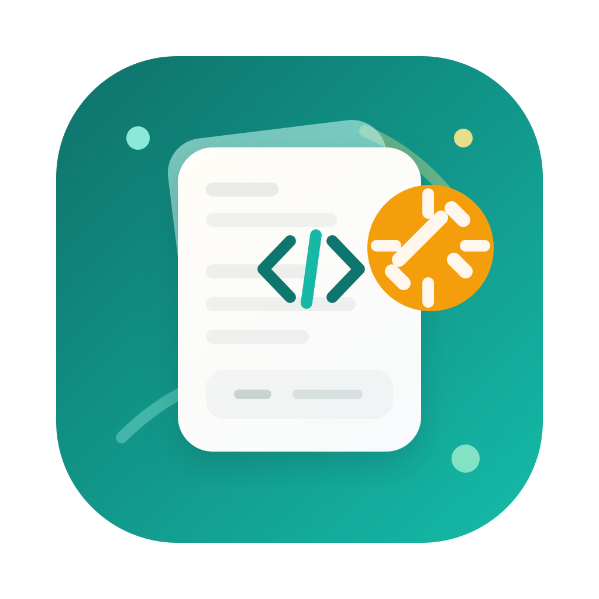

<div align="center">


<h1>Meta Skill Generator</h1>

[English](./README.md) | 中文

</div>

本仓库提供一个 meta skill，用来根据用户的自然语言需求生成或改写 `SKILL.md`。

目标很明确：把模糊的工作流描述变成一个简洁、可复用、可上线的 skill，同时尽量不浪费上下文窗口。这个 skill 会帮助选择合适的结构、编写能正确触发的 frontmatter、判断是否真的需要额外资源，并让最终产物保持精炼。

`SKILL.md` 是行为规范的唯一权威来源；README 主要提供快速上手说明。

## 这个 Skill 能做什么

- 根据用户需求起草新的 `SKILL.md`
- 改写已有 skill，优化范围、触发条件和结构
- 为任务选择最轻量、最合适的 skill 组织方式
- 判断是否真的需要 `scripts/`、`references/` 或 `assets/`
- 在需要时补充 `agents/openai.yaml` 这类界面元数据

## 安装为 CLI Skill

本仓库按 Agent Skills 结构组织：skill 根目录包含 `SKILL.md`。

请在当前目录执行以下命令：

### Claude Code

```bash
mkdir -p ~/.claude/skills
ln -s "$(pwd)" ~/.claude/skills/meta-skill-generator
```

### Codex

```bash
mkdir -p ~/.codex/skills
ln -s "$(pwd)" ~/.codex/skills/meta-skill-generator
```

### Cursor

```bash
mkdir -p ~/.cursor/skills
ln -s "$(pwd)" ~/.cursor/skills/meta-skill-generator
```

### 其他 CLI 工具

把本目录放到对应 CLI 的 skills 目录中，并命名为 `meta-skill-generator`。

安装后，重启对应 CLI 或刷新 skills 列表，再用该工具自己的语法调用 `meta-skill-generator`。

## 快速开始

1. 安装 skill。
2. 调用 `meta-skill-generator`。
3. 粘贴一段简短需求，说明你想要的 skill。

最小输入模板：

```text
Create a skill for <task or domain>.
It should trigger when users ask about <request types>.
The output should help produce <deliverable>.
Constraints: <language, tools, tone, frameworks, file formats>.
```

## Demo

示例用户输入：

```text
/meta-skill-generator Create a skill for reviewing React pull requests.
It should trigger on code review requests, focus on bugs and regressions,
and keep the skill concise. English only.
```

预期输出形式：

- 一个简短、稳定的 hyphen-case skill 名称
- 一段能正确触发的 `description`
- 一个紧凑的 `SKILL.md` 主体，包含 intake、workflow 和质量检查
- 只有在任务确实需要时，才补充资源目录建议

## 仓库内容

- `SKILL.md`：skill 的核心行为定义与写作流程
- `agents/openai.yaml`：可选的界面元数据
- `README.md` 与 `README.zh.md`：中英文快速上手说明

## 设计原则

- 保持 skill 精炼、聚焦
- 优先写清楚触发条件，而不是泛泛描述
- 用 progressive disclosure，而不是把所有内容都塞进 `SKILL.md`
- 只有在明显提升可靠性时才增加资源目录
- 当用户需求不完整时，做合理默认并明确说明假设

## 适合什么场景

当你想做这些事时，这个 skill 很合适：

- 从零创建一个兼容 Codex 的 skill
- 把自然语言流程需求转换成可复用的 `SKILL.md`
- 收紧一个过于模糊、过于臃肿的现有 skill
- 快速搭出一个最小可用 skill，而不是过度设计

## 不太适合什么场景

以下情况这个 skill 价值较小：

- 用户只是想泛泛 brainstorming，并不需要 skill 输出
- 任务本质上只是一次性 prompt，而不是可复用工作流
- 任务需要的是完整框架或代码模板，而不是 skill
